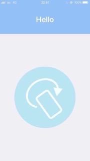
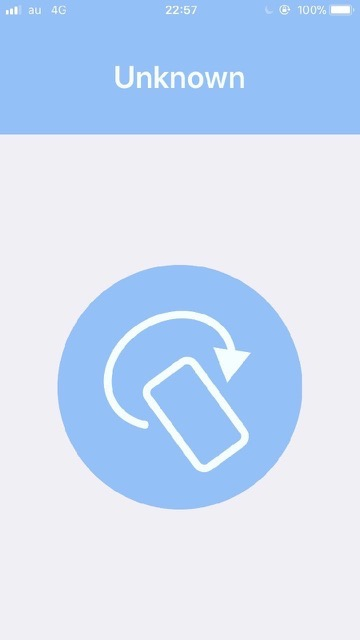
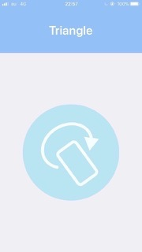

# GestureAI-CoreML-iOS

   

Hand-gesture recognizer using CoreML

## Demo

## Screenshots

  

This app is using RNN(Recurrent Neural network) with CoreML on iOS11. The model recognizes the gesture as long as the center button is pressed.

Click [here](https://github.com/akimach/GestureAI) to read more about GestureAI.

## Install

1. Clone this repository.
2. Download `GestureAI.mlmodel` (Trained RNN model) from [here](https://goo.gl/avdMjD).
3. Open `GestureAI.xcodeproj`
4. Drag and drop `GestureAI.mlmodel` to Xcode.
5. Add `GestureAI.mlmodel` into **Compile Sources** in Build Phases.
6. Build and run.

# Guide To CoreML Models

See [likedan/Awesome-CoreML-Models](https://github.com/likedan/Awesome-CoreML-Models).

## Licence

[MIT](https://github.com/akimach/GestureAI-iOS/blob/master/LICENSE)

## Author

[Akimasa KIMURA](https://github.com/akimach)
